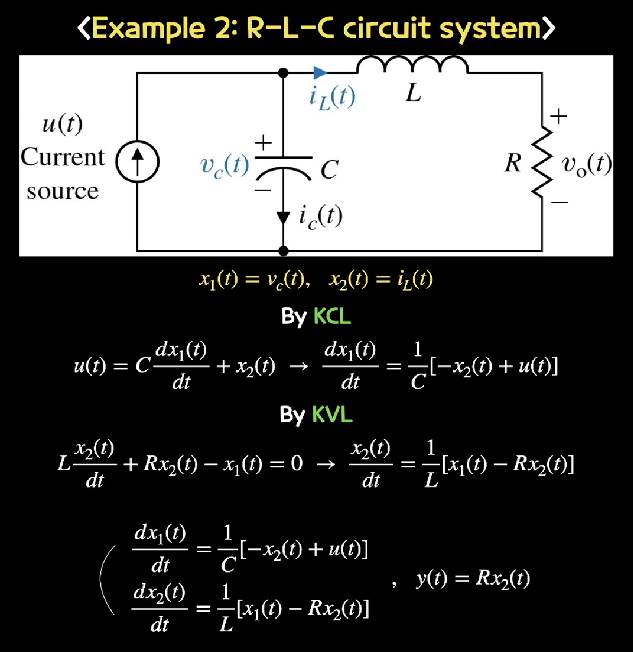

# 5주차 강의 요약 과제
## 2020732003 박찬우
### State Variables와 State Space Equation
------------
예를 들어 출력 30을 얻기위해 A 상태의 시스템 X에 10을 입력한다고 할 때, 만약 시스템의 상태가 B로 변화하면 10을 입력했을 때 출력 30을 보장할 수 없게 된다. 따라서 30이라는 출력을 얻기 위해 시스템의 상태가 변화함에 따라 적절한 입력을 넣어줄 필요가 있다. 이런 변화하는 시스템을 `state variables`를 통해 상태를 표현할 수 있고 이를 수식으로 표현한 것이 `State Space Equation`이다.
`State Space Equation`은 
```
\begin{aligned}
\dot{x}(t) &= A\,x(t) + B\,u(t) \\
y(t) &= C\,x(t) + D\,u(t)
\end{aligned}
```
로 표현되는데 첫번째 수식은 상태 미분 방정식이고 두번째는 출력 방정식이다.
즉, 기존의 n차 미분방정식으로 표현되던 모델을 1차 행렬 미분방정식의 상태공간 방정식으로 시스템을 표현함으로써 문제를 보다 쉽게 해결할 수 있게 된다.
이러한 방식으로 문제를 해결하기 위해선 우선 state variable을 먼저 정의해야 하는데 이때 정의되는 state variable이 서로 항등식이 되지 않도록 유의해야한다. 예를 들어 수업에서 사용된 example 2번의 경우


x_1(t)와 x_2(t)를 각각 
